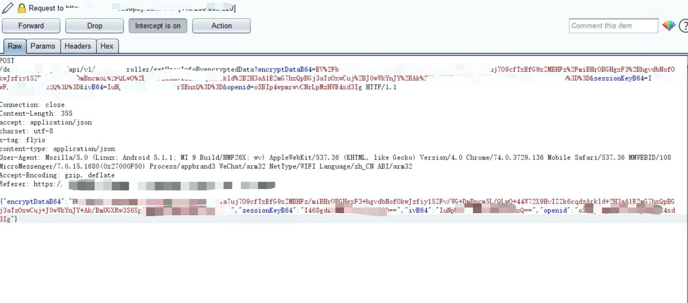
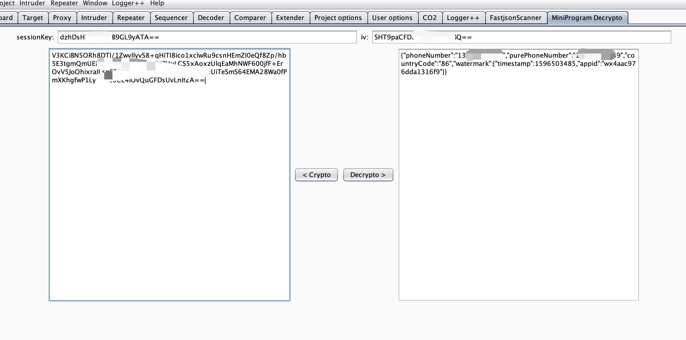

## 简介
用于对小程序手机快捷登陆的数据进行解密，修改加密。  
具体相关的内容可以看文章1.  

## 使用
直接添加到burp即可，不支持自动提取，问就是没有。  
需要session_key,iv，session_key的获取还是看文章1.  
  



## 坑
可能碰到报错的问题，如果是  
```java.security.NoSuchAlgorithmException:Cannot find any provider supporting AES/CBC/PKCS7Padding```
可以看文章2进行解决。  


## 文章
[微信小程序的修炼五脉（如意篇上）](https://mp.weixin.qq.com/s/mIu52sQT-oj-awk4pLYLVg)  
[报错解决](https://blog.csdn.net/qq_43225978/article/details/94459412)
